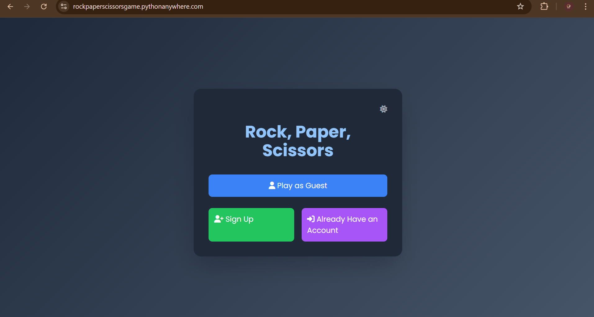
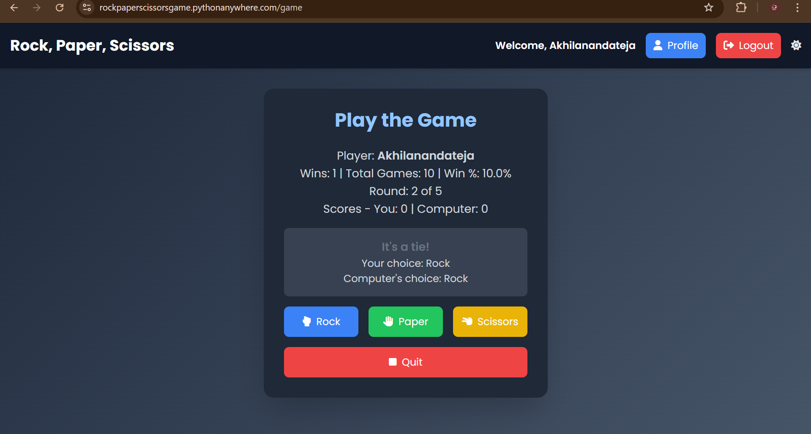

<b>Rock, Paper, Scissors Web Game</b>

A Flask-based web application for playing Rock, Paper, Scissors against the computer. Features user authentication (signup, login, guest play), customizable rounds, and a detailed profile page with game stats and history. Styled with Tailwind CSS and Font Awesome for a sleek, responsive design.\n

Key Features:\n
1.User Authentication: Sign up, log in, or play as a guest.\n
2.Gameplay: Choose from 3 to 100 rounds and compete against the computer.\n
3.Profile Stats: View wins, win percentage, win streak, win/loss ratio, and recent games.\n
4.Responsive Design: Built with Tailwind CSS and Font Awesome for a modern UI.\n
5.Database: Uses SQLite (Flask-SQLAlchemy) with plans to migrate to MySQL.\n

Planned Enhancements:\n
Pagination for game history.\n
Leaderboard to showcase top players.\n
MySQL migration for scalability.\n

